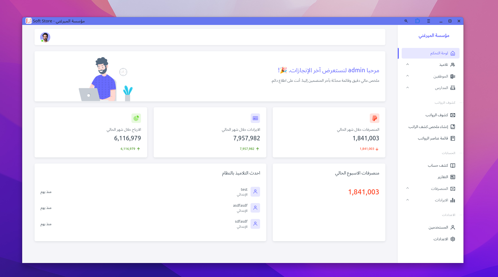
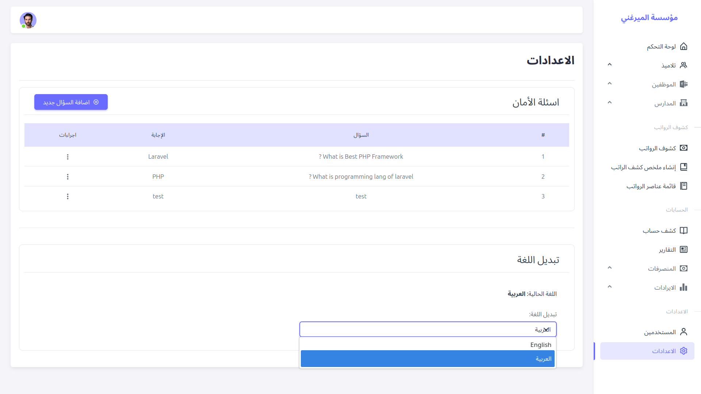
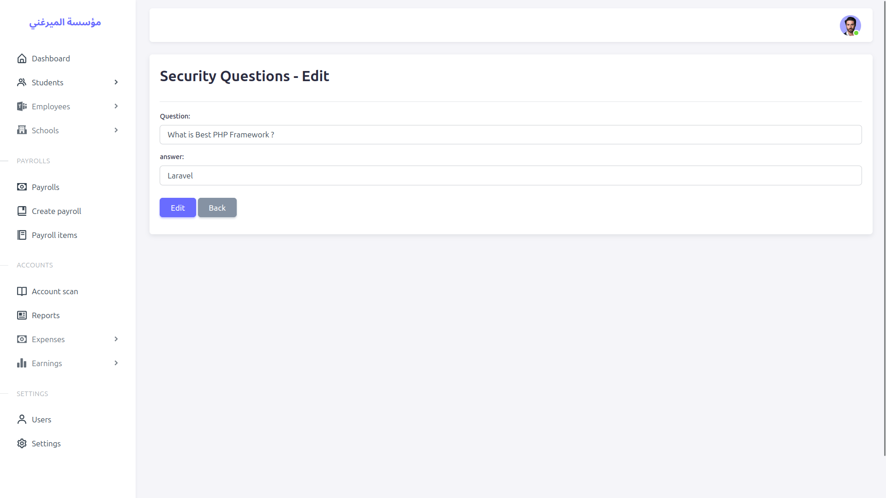

# AL-Mirgani School Accounting System

A comprehensive web-based accounting and management system designed for schools. Built with **Laravel**, this application streamlines financial operations, student fee management, employee payroll, and generates detailed financial reports. 

## 🚀 Key Features

### 🎓 Student Management 
- **Comprehensive Profile Management**: 
  - Store detailed student information including full name, address, academic stage, and class.
  - Auto-generated unique student numbers (format: `YYYY00001`) based on enrollment year.
  - Manage parent/guardian contact details (Father's name, multiple phone numbers).
  - **Phone Validation**: System prevents duplicate phone numbers across students and employees.
  - Track student health history (diagnoses, medications, notes) for medical reference.
  - **Search & Filter**: Quickly find students by name with search.
  
- **Advanced Fee Structure**: 
  - **Registration Fees**: Separate tracking for one-time initial registration payments.
  - **Tuition Fees**: Flexible total fee management with percentage-based discount capabilities.
  - **Installment Plans**: Create unlimited custom installment schedules with individual due dates and amounts.
  - **Installment Numbering**: Each installment gets a unique identifier for tracking.
  
- **Payment Processing**: 
  - **Dual Payment Methods**: 
    - **Cash (كاش)**: Direct cash payment tracking.
    - **Bankak (بنكك)**: Bank transfer with mandatory transaction ID validation.
  - **Transaction ID Validation**: Unique transaction IDs across all financial modules (prevents duplicate entries).
  - **Receipt System**: 
    - Receipts list show receipts data and student name with search input.
    - Auto-generate timestamped receipt numbers (e.g., `RC-1733745678`).
    - Receipts linked to specific installment payments.
    - Print-ready receipt format.
  - **Payment History**: 
    - balance calculation (Total - Paid = Remaining).
    - Track payment dates, methods, and collectors.
    - View payment status per installment (Paid/Partially Paid/Unpaid).
  - **Outstanding Balance Alerts**: Identify students with overdue installments.

### 👥 Employee Management
- **Staff Administration**: 
  - Comprehensive employee database (Name, Phone, Hire Date, Salary, Department).
  - **Department Categories**: Teachers, Workers, Administrative.
  - **Duplicate Prevention**: Phone number uniqueness validation across all records.
  - **Employee Count Reports**: Track staff distribution by department.
  
- **Advanced Payroll System**: 
  - **Flexible Salary Structure**: 
    - **Basic Salary**: Fixed monthly base pay.
    - **Fixed Allowances**: Regular monthly additions (housing, transport, etc.).
    - **Variable Additions**: One-time bonuses or incentives.
    - **Deductions**: subtractions.
  - **Payroll Items Management**: 
    - Create custom payroll line items (e.g., "Overtime", "Health Insurance").
    - Mark items as "Addition" or "Deduction".
    - Set default values for recurring items.
  - **Monthly Payroll Processing**: 
    - Generate payrolls for specific month/year combinations.
    - **Duplicate Prevention**: System blocks duplicate payrolls for the same employee in the same month/year.
    - Track payment status: Pending, Paid, or Failed.
    - Support for multiple payment methods (Cash/Bankak).
  - **Payslip Generation**: Professional salary slip printouts with detailed breakdowns.
  - **Historical Tracking**: Complete payroll history with filtering by month/year/employee.
  - **Notifications**: Auto-notify all users when employees are added or removed.

### 💰 Financial Management
- **Multi-School Support**: 
  - Manage finances across multiple school branches/locations.
  - Filter reports by specific school or view consolidated data.
  - Track income and expenses per school branch.
  
- **Income & Expense Tracking**: 
  - **Earnings Module**: 
    - Record all income sources (student fees, external revenue).
    - Link earnings to specific schools.
    - Transaction ID tracking for bank transfers.
    - Date-based income logging.
  - **Expenses Module**: 
    - **15+ Expense Categories** with automatic classification:
      - **Operating Expenses**: Salaries (الرواتب), Incentives (الحوافز).
      - **Service Expenses**: Rents (الإيجارات), Furniture (الأثاث), Electricity & Water (المياه والكهرباء), Maintenance (الصيانة).
      - **Non-Operating**: Books (الكتب), Buffet (البوفيه), Financial Aid (المساعدات), Inter-Branch Transfers (جاري الفروع), Management (الإدارة), Printed Exams (طباعة امتحانات), Transportation (التنقلات), Uniforms (الزي المدرسي), School Supplies (أدوات مدارس), Other (أخرى).
    - Expense categorization for detailed financial analysis.
  - **Payment Method Support**: All transactions support Cash or Bankak with transaction IDs.
  
- **Daily Accounts Dashboard**: 
  - **Opening Balance**: Calculated from all previous transactions.
  - **Daily Transactions**: view of income (green) vs expenses (red).
  - **Running Balance**: Cumulative balance updates with each transaction.
  - **Closing Balance**: End-of-day financial position.
  - **Advanced Filters**: Date range, specific school, payment method.

### 📊 Comprehensive Reporting & Analytics
- **Income Statement (Profit & Loss)**: 
  - **Revenue Section**: 
    - Total Fee Revenue from students.
    - Total Operating Revenue calculation.
  - **Operating Expenses**: Salaries + Incentives breakdown.
  - **Service Expenses**: Utilities, rent, maintenance, furniture.
  - **Non-Operating Expenses**: Books, uniforms, transport, etc. (9+ categories).
  - **Financial Metrics**: 
    - Net Operating Income = Revenue - Operating Expenses.
    - Net Profit = Net Operating Income - (Services + Non-Operating Expenses).
  - **Date Range Filtering**: Custom period selection (e.g., entire year, quarter, month).
  - **School-Specific Reports**: View P&L for individual branches or consolidated.
  
- **Arrears (Overdue Payments) Report**: 
  - **Automatic Detection**: System identifies installments past due date.
  - **Detailed Metrics**: 
    - Student name, class, and school.
    - Installment number and original due date.
    - Amount due vs amount paid vs balance remaining.
    - **Days Overdue Calculation**: Auto-calculated from due date to today.
  - **Multi-Filter Options**: Filter by specific class, school, or custom date.
  - **Pagination**: Handle large datasets with 15 records per page.
  
- **Student Account Statement**: 
  - **Complete Financial Ledger** for individual students:
    - Gross Fees (total before discounts).
    - Discount Amount (if applicable).
    - Net Fees (gross - discount).
    - Total Paid (sum of all payments with receipts).
    - Balance Due (net fees - total paid).
  - **Registration Fee Summary**: Separate tracking of initial registration payment.
  - **Installment Schedule Table**: 
    - Installment number, due date, amount, and payment status.
    - Sorted chronologically by due date.
  - **Payment Log**: 
    - Chronological list of all payments.
    - Date, receipt number, statement/description, amount, payment method, transaction ID.
    - Shows collector name for each payment.
    
- **Payroll Summary Report**: 
  - **Aggregate Calculations**: 
    - Sum of all basic salaries for the period.
    - Total fixed allowances.
    - Total variable additions.
    - Total deductions.
    - Total net salaries paid.
  - Filter by month, year, and payment method.
  
- **Daily Financial Activity Report**: 
  - **Transaction-by-Transaction Breakdown**: Every income and expense entry.
  - **Statement/Description**: Purpose of each transaction.
  - **Running Balance Column**: Track balance changes throughout the day.
  - Filter by date and school branch.
  
- **Student Count Report**: 
  - Distribution of students by school branch.
  - Distribution of students by class/grade.
  - Visual breakdown for quick insights.
  
- **Employee Count Report**: 
  - Staff distribution by department.
  - Total employee headcount.

### 🔐 Security & System Settings
- **Secure Authentication**: 
  - Laravel's built-in authentication with session management.
  - "Remember Me" functionality with secure cookie handling.
  - Session regeneration on login to prevent fixation attacks.
  
- **Password Security**: 
  - **Multi-Layer Recovery Flow**: 
    1. Username verification (prevents enumeration with generic messages).
    2. Random security question selection from user's saved questions.
    3. Answer verification.
    4. Password reset with strong validation.
  - **Password Requirements**: Minimum 6 characters, must include numbers and symbols.
  - **Strong Hashing**: Bcrypt algorithm with automatic salt generation.
  
- **Security Questions**: 
  - Users can create up to 3 custom security questions.
  - Questions and answers stored for password recovery.
  - CRUD operations with ownership validation (users can only manage their own questions).
  
- **Data Integrity & Validation**: 
  - **Server-Side Validation**: All forms validated using Laravel Form Requests.
  - **Custom Validation Rules**: 
    - `RequiredIfBankak`: Ensures transaction ID is provided for bank transfers.
    - `UniqueInTables`: Validates transaction ID uniqueness across 5+ tables.
  - **Mass Assignment Protection**: Models use explicit `$fillable` arrays.
  - **CSRF Protection**: All forms protected against Cross-Site Request Forgery.
  - **XSS Prevention**: Blade templates auto-escape output, `strip_tags()` on search inputs.
  - **Database Transactions**: Critical operations wrapped in transactions (e.g., receipt creation + balance updates).
  - **Input Sanitization**: Special characters stripped from user inputs before database queries.
  
- **Notifications System**: 
  - notifications to all users when:
    - New employees are added.
    - Employees are removed.
    - Passwords are successfully reset.
  - Laravel's notification system for reliable delivery.
  
- **Multi-Language Support**: 
  - Full bilingual interface (Arabic and English).
  - Language switching with persistent session storage.
  - Localized validation messages and error handling.
  - RTL (Right-to-Left) support for Arabic interface.

---

## 🛠️ Technical Stack
- **Framework**: Laravel 12 (PHP 8.3)
- **Database**: SQLite 
- **Frontend**: Blade Templates, and read-to-use themesection template
- **Security**: CSRF Protection, XSS Prevention, Secure Password Hashing (Bcrypt)
- **Notification channels**: in-database notification (SQLite)

---

## 📸 Screenshots

### Dashboard & Overview
| | |
|:---:|:---:|
|  | 

### Student & Financial Management
| | |
|:---:|:---:|
|  |  |
|  |  |
|  |  |

### Reports & Analytics
| | |
|:---:|:---:|
|  |  |
|  |  |
 |  | 

### System Settings & Others
| | |
|:---:|:---:|
|  |  |

*(More screenshots available in the `screens/` directory)*

---

Mohamed anwer - 2025
