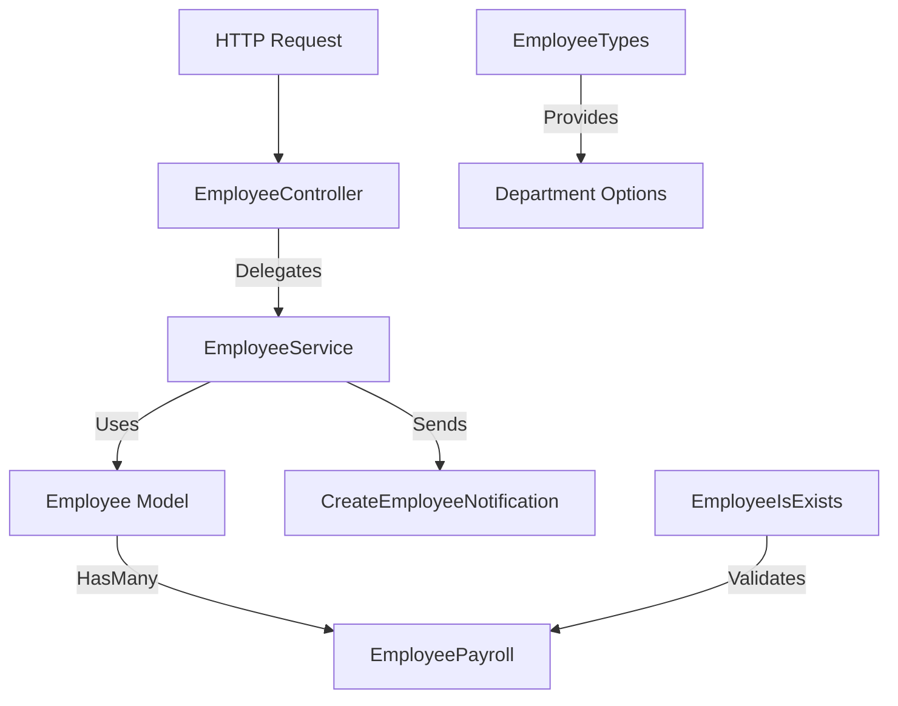
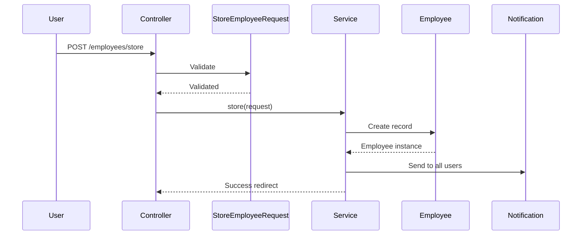
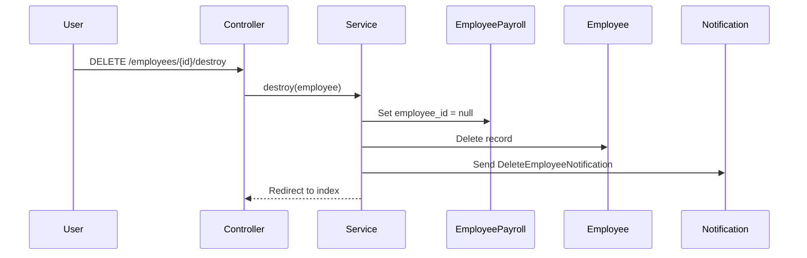

# Employee Module Technical Documentation

This document outlines the technical architecture and implementation details of the Employee management module. This module handles employee records, departments, and integrates with the payroll system.

## Architecture Overview

The module follows a **Service-Oriented Architecture** with notifications for employee lifecycle events.

---

## Component Details

### 1. EmployeeTypes Enum
**File**: [EmployeeTypes.php](file:///home/moanwer/Desktop/laravel_projects/Mergane_school/app/Enums/EmployeeTypes.php)

Defines the types of employees in the system (Arabic values).

| Case | Value |
|------|-------|
| `TEACHER` | معلم (Teacher) |
| `WORKER` | عامل (Worker) |
| `MANAGER` | إدراي (Manager) |

### 2. Employee Model
**File**: [Employee.php](file:///home/moanwer/Desktop/laravel_projects/Mergane_school/app/Models/Employee.php)

*   **Fillable Attributes**:
    *   `full_name`: Employee's full name
    *   `phone_number`: Contact number
    *   `hire_date`: Date of hiring
    *   `salary`: Base salary amount
    *   `department`: Employee type (from `EmployeeTypes` enum)
*   **Relationships**:
    *   `payrolls()`: HasMany `EmployeePayroll`
*   **Accessors**:
    *   `formatted_salary`: Returns salary with number formatting

### 3. Routes
**File**: [employees.php](file:///home/moanwer/Desktop/laravel_projects/Mergane_school/routes/employees.php)

| Route | Method | Action | Name |
|-------|--------|--------|------|
| `/employees` | GET | `index` | `employees.index` |
| `/employees/create` | GET | `create` | `employees.create` |
| `/employees/store` | POST | `store` | `employees.store` |
| `/employees/{employee}/show` | GET | `show` | `employees.show` |
| `/employees/{employee}/edit` | GET | `edit` | `employees.edit` |
| `/employees/{employee}/update` | PUT | `update` | `employees.update` |
| `/employees/{employee}/delete` | GET | `delete` | `employees.delete` |
| `/employees/{employee}/destroy` | DELETE | `destroy` | `employees.destroy` |

### 4. Employee Controller
**File**: [EmployeeController.php](file:///home/moanwer/Desktop/laravel_projects/Mergane_school/app/Http/Controllers/Employees/EmployeeController.php)

Thin controller delegating all logic to `EmployeeService`.

*   **Dependency Injection**: `EmployeeService`
*   **Request Classes Used**:
    *   `StoreEmployeeRequest`: For creating employees
    *   `UpdateEmployeeRequest`: For updating employees

### 5. Employee Service
**File**: [EmployeeService.php](file:///home/moanwer/Desktop/laravel_projects/Mergane_school/app/Services/Employee/EmployeeService.php)

Core business logic for employee management.

*   **Key Features**:
    *   **Create**: Creates employee and sends `CreateEmployeeNotification` to all users
    *   **Update**: Updates employee with validated data
    *   **Delete**: 
        1. Nullifies `employee_id` in related payrolls (preserves payroll history)
        2. Deletes employee record
        3. Sends `DeleteEmployeeNotification` to all users

### 6. Form Request Validation

#### StoreEmployeeRequest
*   `full_name`: Required, max 255 chars
*   `phone_number`: Required, unique across `employees`, `fathers.phone_one`, `fathers.phone_two`
*   `hire_date`: Optional
*   `salary`: Required, max 15 digits
*   `department`: Required

### 7. Middleware
**File**: [EmployeeIsExists.php](file:///home/moanwer/Desktop/laravel_projects/Mergane_school/app/Http/Middleware/EmployeeIsExists.php)

Validates that a payroll record has an associated employee. Used in payroll routes to prevent operations on orphaned payrolls.

### 8. Notification
**File**: [CreateEmployeeNotification.php](file:///home/moanwer/Desktop/laravel_projects/Mergane_school/app/Notifications/CreateEmployeeNotification.php)

*   **Channel**: Database
*   **Payload**: Icon, color (success), localized title and message with employee name

---

## Key Workflows

### Creating an Employee

### Deleting an Employee

> [!IMPORTANT]
> When an employee is deleted, their payroll records are **preserved** but the `employee_id` is set to `null`. This maintains financial history while removing the employee.

---

## Views Structure

| View | Purpose |
|------|---------|
| `employees-list.blade.php` | Paginated employee listing |
| `create-employee-form.blade.php` | New employee form |
| `edit-employee-form.blade.php` | Edit employee form |
| `employee-profile.blade.php` | Employee details view |
| `delete-employee.blade.php` | Delete confirmation page |
| `payments/` | Subdirectory for payment-related views |

---

## Integration with Payroll

The Employee module integrates tightly with the Payroll module:
- Each employee can have multiple payroll records (`hasMany`)
- Payroll records reference employee's base salary
- Middleware ensures payroll operations only work with valid employees
