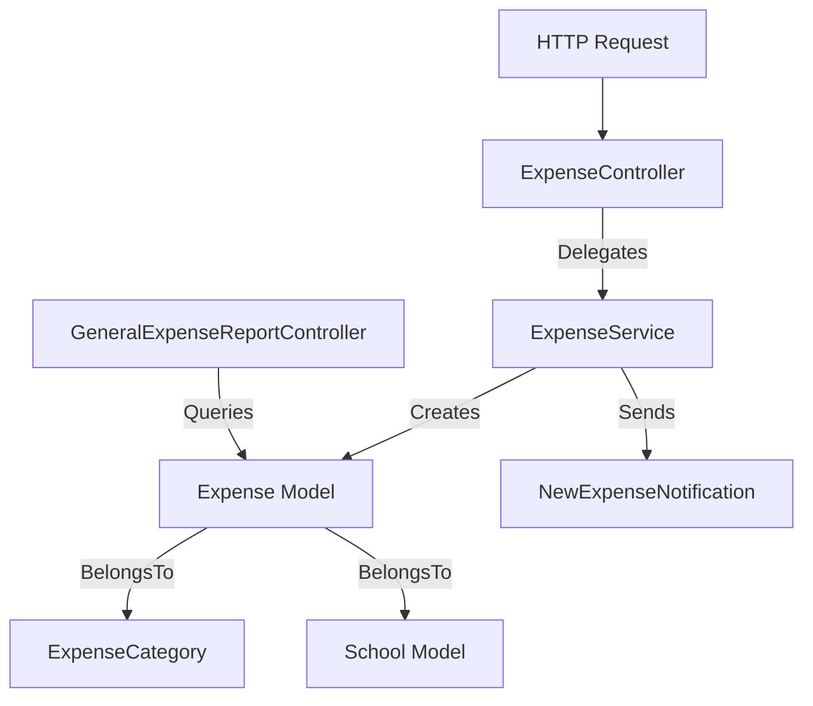
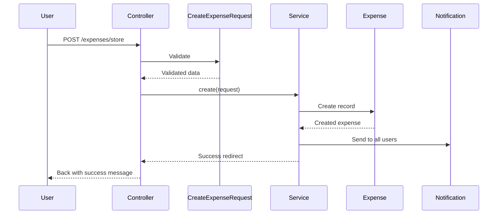

# Expense Module Technical Documentation

This document outlines the technical architecture and implementation details of the Expense management module. This module handles recording and tracking of school expenses across different categories and payment methods.

## Architecture Overview

The module follows a **Service-Repository pattern** with notification capabilities for real-time updates to system users.



---

## Component Details

### 1. Expense Models

#### ExpenseCategory Model
**File**: [ExpenseCategory.php](file:///home/moanwer/Desktop/laravel_projects/Mergane_school/app/Models/ExpenseCategory.php)

Represents categories for classifying expenses (e.g., Salaries, Utilities, Supplies).

*   **Traits**: `ReadableHumanDate` - Provides human-readable date formatting
*   **Attributes**: `name` (fillable)
*   **Relationships**:
    *   `expenses()`: HasMany relationship to `Expense`

#### Expense Model
**File**: [Expense.php](file:///home/moanwer/Desktop/laravel_projects/Mergane_school/app/Models/Expense.php)

Represents individual expense records.

*   **Key Attributes**:
    *   `amount`: Expense amount
    *   `category_id`: Foreign key to ExpenseCategory
    *   `school_id`: Foreign key to School
    *   `date`: Date of expense (cast to Date)
    *   `statement`: Description/purpose of expense
    *   `user_id`: User who recorded the expense
    *   `payment_method`: "كاش" (Cash) or "بنكك" (Bankak)
    *   `transaction_id`: Reference ID for bank transactions
*   **Relationships**:
    *   `category()`: BelongsTo `ExpenseCategory` (with default empty name)
    *   `school()`: BelongsTo `School` (with default empty name)
*   **Accessors**:
    *   `formatted_amount`: Returns formatted amount with currency symbol

### 2. Expense Controller
**File**: [ExpenseController.php](file:///home/moanwer/Desktop/laravel_projects/Mergane_school/app/Http/Controllers/Expense/ExpenseController.php)

Thin controller that delegates business logic to `ExpenseService`.

*   **Dependency Injection**: `ExpenseService`
*   **Key Methods**:
    *   `index()`: Lists all expenses (delegates to service)
    *   `create()`: Shows expense creation form with categories and schools
    *   `store(CreateExpenseRequest $request)`: Handles expense creation

### 3. Expense Service
**File**: [ExpenseService.php](file:///home/moanwer/Desktop/laravel_projects/Mergane_school/app/Services/Expense/ExpenseService.php)

Contains core business logic for expense management.

*   **Dependencies**:
    *   `Expense`: For database operations
    *   `ExpenseCategory`: For category lookups
    *   `School`: For school lookups
*   **Key Features**:
    *   **Filtering**: Supports filtering by category, school, date, payment method, and transaction ID
    *   **Pagination**: Returns 15 expenses per page
    *   **Notifications**: Sends `NewExpenseNotification` to all users upon creation
    *   **Error Handling**: Try-catch blocks with error reporting

### 4. Form Request Validation
**File**: [CreateExpenseRequest.php](file:///home/moanwer/Desktop/laravel_projects/Mergane_school/app/Http/Requests/Expense/CreateExpenseRequest.php)

Handles validation for expense creation.

*   **Authorization**: Requires authenticated user
*   **Validation Rules**:
    *   `statement`: Required string (description)
    *   `amount`: Required, max 15 digits
    *   `category_id`, `school_id`, `date`: Required
    *   `transaction_id`:
        *   Required if payment method is "بنكك" (`RequiredIfBankak` custom rule)
        *   Must be unique across multiple financial tables (`UniqueInTables` custom rule)
        *   Max 15 digits

### 5. Notification
**File**: [NewExpenseNotification.php](file:///home/moanwer/Desktop/laravel_projects/Mergane_school/app/Notifications/NewExpenseNotification.php)

Notifies all system users when a new expense is created.

*   **Channel**: Database notifications only
*   **Payload**:
    *   Icon, color (danger)
    *   Localized title and message
    *   Includes expense amount and school name

### 6. Reporting
**File**: [GeneralExpenseReportController.php](file:///home/moanwer/Desktop/laravel_projects/Mergane_school/app/Http/Controllers/Reports/GeneralExpenseReportController.php)

Generates expense summary reports with filtering capabilities.

*   **Filters**:
    *   School ID
    *   Date range (defaults to current year start/end)
    *   Category
    *   Payment method
*   **Output**: Total expenses for filtered criteria

---

## Key Workflows

### 1. Creating an Expense



**Steps**:
1. User submits expense form with amount, category, school, date, statement, and payment details
2. `CreateExpenseRequest` validates:
   - All required fields present
   - Transaction ID unique across system if payment method is "Bankak"
3. `ExpenseService::create()` stores the expense
4. Service sends notification to all users
5. User redirected with success message

### 2. Filtering Expenses
Users can filter expense lists by:
- **Category**: Filter by expense type
- **School**: Show expenses for specific school only
- **Date**: Filter by exact date
- **Payment Method**: Cash vs. Bankak
- **Transaction ID**: Search by specific transaction

### 3. Generating Reports
The reporting system uses the same `Expense` model with query builders to:
- Filter by date range
- Filter by school/category/payment method
- Calculate total expenses with `sum('amount')`

---

## Transaction ID Validation

The system enforces **strict uniqueness** of `transaction_id` across multiple financial tables to prevent duplicate entries:
- `earnings`
- `expenses`
- `registration_fees`
- `installment_payments`
- `employee_payrolls`

This ensures financial integrity across the entire system.

---

## Code Snippets

**Service: Expense Creation**
```php
public function create(Request $request)
{
    try {
        $expense = $this->expense->create($request->validated());

        Notification::sendNow(User::all(), new NewExpenseNotification($expense));

        return back()->with('message', __('app.create_successful', ['attribute' => __('app.expense')]));
    } catch (Exception $e) {
        report($e);
        return back()->with('error', __('app.error'));
    }
}
```

**Service: Expense List with Filters**
```php
public function expensesList()
{
    $filters = [
        'category_id'    => request()->query('category_id'),
        'school_id'      => request()->query('school_id'),
        'date'           => request()->query('date'),
        'payment_method' => request()->query('payment_method'),
        'transaction_id' => request()->query('transaction_id'),
    ];

    $data = $this->expense
        ->query()
        ->with('school:id,name', 'category:id,name')
        ->when($filters['category_id'], fn($q) => $q->where('category_id', $filters['category_id']))
        ->when($filters['school_id'], fn ($q) => $q->where('school_id', $filters['school_id']))
        // ... additional filters
        ->latest()
        ->paginate(15);
    // ...
}
```