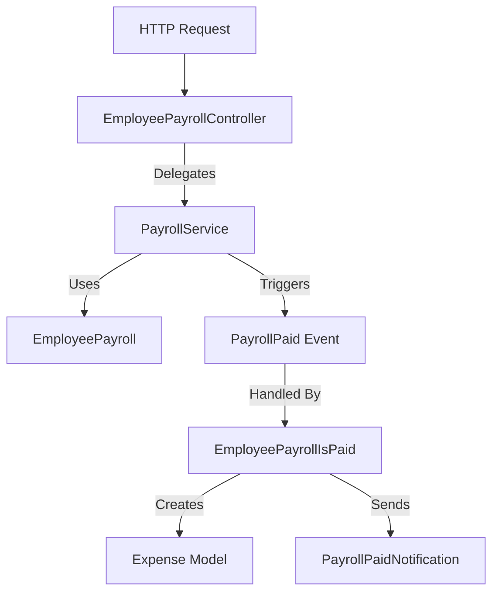

# Payroll Module Technical Documentation

This document outlines the technical architecture and implementation details of the Payroll management module. This module handles employee salary generation, payment processing, and expense recording.

## Architecture Overview

The module follows a **Service-Repository pattern** (simplified as Controller-Service-Model), with an **Event-Listener** component for handling side effects like expense recording.



---

## Component Details

### 1. EmployeePayroll Model
**File**: `app/Models/EmployeePayroll.php`

Represents a single payroll record for an employee for a specific month/year.

*   **Table**: `employee_payrolls`
*   **Key Attributes**:
    *   `basic_salary_snapshot`: The salary amount at the time of payroll creation.
    *   `net_salary_paid`: Final amount paid after additions/deductions.
    *   `payment_status`: Enum (`Pending`, `Paid`, `Failed`).
    *   `payment_method`: e.g., "Cash", "Bankak".
    *   `transaction_id`: Reference ID for bank transactions.
*   **Relationships**:
    *   `employee()`: BelongsTo `Employee`.
    *   `details()`: HasMany `PayrollDetail` (Individual additions/deductions).
*   **Helper Methods**:
    *   `isPaid()`, `isPending()`, `isFailed()`: Status checks.

### 2. EmployeePayroll Controller
**File**: `app/Http/Controllers/Employees/EmployeePayrollController.php`

Acts as the entry point for HTTP requests. It is a "thin controller" that delegates all business logic to the `PayrollService`.

*   **Dependency Injection**: `PayrollService`
*   **Methods**: Maps standard CRUD actions (`index`, `create`, `store`, `show`, `edit`, `update`, `destroy`) and specific actions (`payrollInvoice`, `delete`) to service methods.

### 3. Payroll Service
**File**: `app/Services/Payroll/PayrollService.php`

Contains the core business logic for payroll management.

*   **Key Responsibilities**:
    *   **Listing**: Filters payrolls by month, year, employee, status, etc.
    *   **Creation (`store`)**:
        *   Creates payroll records.
        *   Handles payment method logic (validating `transaction_id` for "Bankak").
        *   Triggers `PayrollPaid` event if status is 'Paid'.
    *   **Updates (`update`)**:
        *   Prevents editing if already paid (in `editPage`).
        *   **Recalculation**: If `basic_salary_snapshot` changes, it calls `recalculatePayrollSummary` to update net salary based on existing details.
        *   Updates transaction details.
    *   **Deletion**: Force deletes payroll and associated details.

### 4. Form Request
**File**: `app/Http/Requests/Payroll/StorePayrollRequest.php`

Handles validation for creating payrolls.

*   **Rules**:
    *   Ensures unique payroll per employee per month/year.
    *   `transaction_id`:
        *   Required if payment method is "Bankak" (`RequiredIfBankak` rule).
        *   Must be unique across multiple financial tables (`UniqueInTables` rule).

### 5. Event Listener
**File**: `app/Listeners/EmployeePayrollIsPaid.php`

Listens for the `PayrollPaid` event, which is fired when a payroll is marked as 'Paid'.

*   **Actions**:
    1.  **Create Expense**: Automatically records an entry in the `expenses` table under the 'Salaries' category.
    2.  **Notify**: Sends a `PayrollPaidNotification` to all system users.

---

## Key Workflows

### 1. Creating a Payroll
1.  User submits form with employee, month, year, and payment details.
2.  `StorePayrollRequest` validates uniqueness and transaction requirements.
3.  `PayrollService::store` creates the record.
    *   If `payment_method` is "Bankak", `transaction_id` is stored.
4.  If `payment_status` is 'Paid', `PayrollPaid` event is fired.
5.  Listener creates a corresponding Expense record.

### 2. Updating a Payroll
1.  `PayrollService::update` validates inputs.
2.  **Transaction Logic**:
    *   If switching to "Bankak" without a transaction ID, it may retain the old one or require a new one based on logic.
    *   If switching away from "Bankak", `transaction_id` is set to null.
3.  **Recalculation**:
    *   If the basic salary is modified, the service recalculates `net_salary_paid` by re-summing all existing additions and deductions.
4.  Database transaction ensures atomicity.

### 3. Payment Verification
*   The system enforces strict checks on `transaction_id` to prevent duplicate financial entries across the entire system (Earnings, Expenses, Fees, etc.).

---

## Code Snippets

**Service: Recalculation Logic**
```php
private function recalculatePayrollSummary(EmployeePayroll $payroll): void
{
    $payroll->load('details.item');

    $totalVariableAdditions = $payroll->details
        ->where('item.type', 'Addition')
        ->sum('amount');

    $totalDeductions = $payroll->details
        ->whereIn('item.type', ['Deduction', 'Tax'])
        ->sum('amount');

    $grossSalary = $payroll->basic_salary_snapshot + $payroll->total_fixed_allowances + $totalVariableAdditions;
    $netSalary = $grossSalary - $totalDeductions;

    $payroll->update([
        'total_variable_additions' => $totalVariableAdditions,
        'total_deductions' => $totalDeductions,
        'net_salary_paid' => $netSalary,
    ]);
}
```

**Listener: Expense Creation**
```php
public function handle(PayrollPaid $event): void
{
    $this->expense->create([
        'amount'      => $event->payroll->net_salary_paid,
        'category_id' => ExpenseCategory::where('name', ExpenseCategoryEnum::SALARIES)->value('id'),
        'date'        => $event->payroll->payment_date->toDateString(),
        'statement'   => __('app.payroll_paid_statement', ...),
        // ...
    ]);
    // ...
}
```
