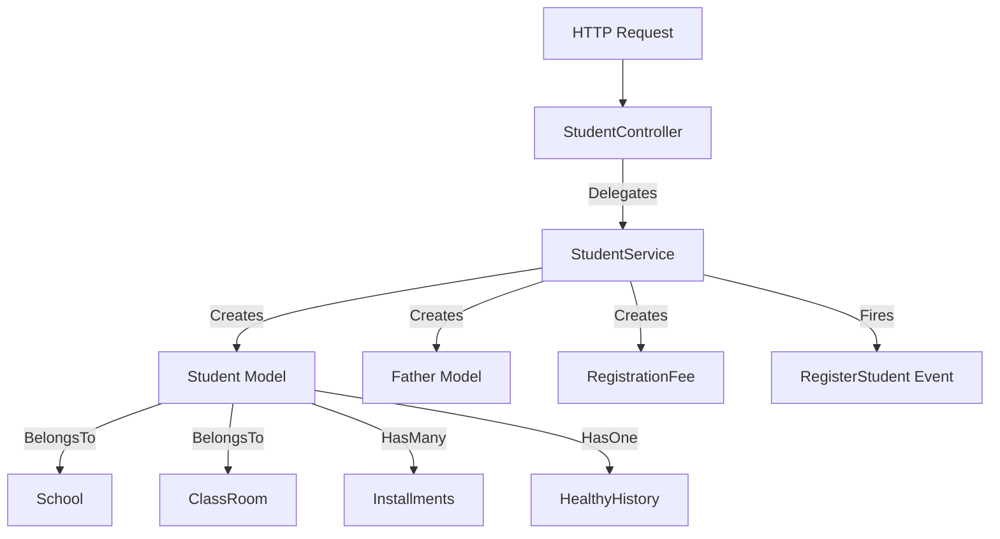
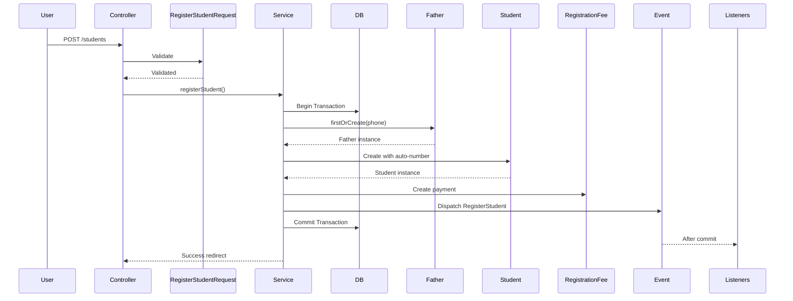

# Student Module Technical Documentation

This document outlines the technical architecture and implementation details of the Student management module. This module handles student registration, profile management, installment tracking, and health records.

## Architecture Overview

The module follows a **Service-Oriented Architecture** with event-driven notifications for registration workflows.



---

## Component Details

### 1. Student Model
**File**: [Student.php](file:///home/moanwer/Desktop/laravel_projects/Mergane_school/app/Models/Student.php)

Represents a student in the school system.

*   **Traits**: `HasFactory`, `ReadableHumanDate`
*   **Guarded**: Empty array (all attributes mass assignable)
*   **Relationships**:
    | Relationship | Type | Related Model | Notes |
    |--------------|------|---------------|-------|
    | `registrationFees()` | HasOne | RegistrationFee | With defaults |
    | `class()` | BelongsTo | ClassRoom | With default |
    | `school()` | BelongsTo | School | With default |
    | `healthyHistory()` | HasOne | StudentHealthyHistory | With defaults |
    | `installments()` | HasMany | Installment | - |
    | `payments()` | HasManyThrough | InstallmentPayment | Via Installment |
    | `father()` | BelongsTo | Father | - |

*   **Key Methods**:
    *   `generateStudentNumber()`: Auto-generates student IDs (format: `YYYY00001`)
    *   `totalPaid()`: Calculates total payments made
    *   `totalPaidBetween($start, $end)`: Calculates payments in date range

### 2. Routes
**File**: [students.php](file:///home/moanwer/Desktop/laravel_projects/Mergane_school/routes/students.php)

| Route | Method | Action | Name |
|-------|--------|--------|------|
| `students/count-report` | GET | `studentsCount` | `students.count-report` |
| `students/delete/{student}` | GET | `delete` | `students.delete` |
| `students/{student}/installments` | GET | `installments` | `students.installments` |
| `accounts/{student}` | GET | Account Statement | `students.accounts` |
| `students` | Resource | Full CRUD | `students.*` |
| `student-healthy-history/show/{student}` | GET | Show Health | `student-healthy-history.show` |
| `student-healthy-history/update/{student}` | PUT | Update Health | `student-healthy-history.update` |

### 3. Student Controller
**File**: [StudentController.php](file:///home/moanwer/Desktop/laravel_projects/Mergane_school/app/Http/Controllers/Student/StudentController.php)

Thin controller delegating to `StudentService`.

*   **Methods**: `index`, `create`, `store`, `show`, `edit`, `update`, `delete`, `destroy`, `installments`, `studentsCount`

### 4. Student Service
**File**: [StudentService.php](file:///home/moanwer/Desktop/laravel_projects/Mergane_school/app/Services/Student/StudentService.php)

Core business logic for student management.

*   **Registration Flow** (`registerStudent`):
    1. Creates or finds `Father` by phone number
    2. Creates `Student` with generated number and calculated discount
    3. Creates `RegistrationFee` record
    4. Fires `RegisterStudent` event

*   **Key Features**:
    *   **Discount Calculation**: `total_fee * (1 - discount/100)`
    *   **Database Transactions**: Registration uses `DB::transaction()`
    *   **Parent Deduplication**: Uses `firstOrCreate` on phone number
    *   **Student Count Report**: Counts by school and class with JOIN queries

### 5. Form Request Validation
**File**: [RegisterStudentRequest.php](file:///home/moanwer/Desktop/laravel_projects/Mergane_school/app/Http/Requests/Student/RegisterStudentRequest.php)

*   **Authorization**: Authenticated users only
*   **Validation Rules**:
    *   Student info: `full_name`, `stage`, `school`, `class`, `total_fee`
    *   Parent info: `parent_name`, `phone_one` (unique across fathers & employees)
    *   Payment: `registration_fee`, `paid_amount`, `payment_method`
    *   `transaction_id`: Required if "بنكك", unique across financial tables

### 6. Event
**File**: [RegisterStudent.php](file:///home/moanwer/Desktop/laravel_projects/Mergane_school/app/Events/Student/RegisterStudent.php)

*   **Implements**: `ShouldDispatchAfterCommit` (fires only after DB transaction commits)
*   **Payload**: `Student $student`

---

## Key Workflows

### Student Registration Flow



### Student Number Generation
```php
// Format: YYYY + 5-digit sequential number
// Example: 2024 + 00001 = 202400001
public static function generateStudentNumber(): int
{
    $year   = now()->year;
    $number = (int) Student::whereYear('created_at', $year)->max('student_number');
    if($number) {
        return ++$number;
    }
    return (int)($year . str_pad(++$number, 5, '0', STR_PAD_LEFT));
}
```

---

## Views Structure

| View | Purpose |
|------|---------|
| `register-new-student.blade.php` | Multi-section registration form |
| `students-list.blade.php` | Searchable/paginated list |
| `student-profile.blade.php` | Student details view |
| `edit-student.blade.php` | Edit form |
| `delete-student.blade.php` | Delete confirmation |
| `student-installments-list.blade.php` | Student's installments |
| `student-healthy-profile.blade.php` | Health records |
| `students_count_report.blade.php` | Statistics by school/class |

---

## Related Features

*   **Healthy History**: Separate controller/service for managing student medical records
*   **Installments**: Student has many installments with payments (tracked via `HasManyThrough`)
*   **Account Statement**: Separate report controller for financial statements
