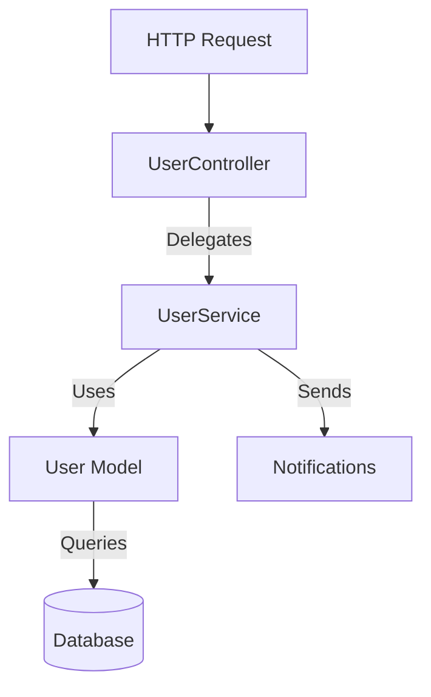

# User Module Technical Documentation

This document outlines the technical architecture and implementation details of the User management module, specifically focusing on the Model, Controller, and Service layers.

## Architecture Overview

The module follows a **Service-Repository pattern** (simplified here as Controller-Service-Model), where:
- **Controller**: Handles HTTP requests and delegates logic.
- **Service**: Contains business logic, validation, and notification handling.
- **Model**: Represents the database entity and handles data interaction.



---

## Component Details

### 1. User Model
**File**: `app/Models/User.php`

The `User` model represents the application's users and extends Laravel's default `Authenticatable` class.

*   **Traits**:
    *   `HasFactory`: Enables factory support for testing/seeding.
    *   `Notifiable`: Allows sending notifications (email, database, etc.) to the user.
*   **Attributes**:
    *   `$fillable`: `name`, `username`, `password` (Mass assignable).
    *   `$hidden`: `password`, `remember_token` (Excluded from array/JSON serialization).
*   **Casts**:
    *   `email_verified_at` $\rightarrow$ `datetime`
    *   `password` $\rightarrow$ `hashed` (Automatically hashes passwords on set).

### 2. User Controller
**File**: `app/Http/Controllers/Users/UserController.php`

The `UserController` acts as a thin layer between the HTTP interface and the business logic. It does not contain business logic itself but delegates entirely to the `UserService`.

*   **Dependency Injection**:
    *   `UserService` is injected into the constructor using PHP 8.2 `readonly` property promotion.
*   **Methods**:
    *   `index()`: Lists users.
    *   `create()`: Shows the user creation form.
    *   `store(Request $request)`: Handles the creation of a new user.
    *   `edit(User $user)`: Shows the user edit form.
    *   `update(Request $request, User $user)`: Handles updating an existing user.
    *   `delete(User $user)`: Shows the delete confirmation page.
    *   `destroy(User $user)`: Handles the actual deletion of a user.

### 3. User Service
**File**: `app/Services/User/UserService.php`

The `UserService` encapsulates the business logic for user management. It handles validation, database transactions, notifications, and response generation (Views/Redirects).

*   **Dependencies**:
    *   `User`: Injected to perform database queries.
*   **Key Features**:
    *   **Validation**:
        *   Validates input directly within `store` and `update` methods.
        *   Custom error messages using `__('validation...')` and `__('app...')`.
    *   **Notifications**:
        *   Triggers `NewUserNotification` to all users when a new user is created.
        *   Triggers `DeleteUserNotification` to all users when a user is deleted.
    *   **Safety Checks**:
        *   Prevents deletion of the default admin user (id 1 or username 'admin'/'default_user').
    *   **Error Handling**:
        *   Uses `try-catch` blocks to catch exceptions.
        *   Logs errors using `report($th)`.
        *   Redirects back with error messages upon failure.

---

## Relationships and Data Flow

### Controller $\leftrightarrow$ Service
The `UserController` has a **dependency** on `UserService`. It calls service methods directly, returning their result (which are typically `View` or `RedirectResponse` objects).

### Service $\leftrightarrow$ Model
The `UserService` has a **dependency** on the `User` model.
- It uses `$this->user->latest()->paginate(15)` to fetch lists.
- It uses `$this->user->create($data)` to create records.
- It calls `$user->update($data)` and `$user->delete()` on model instances passed to it.

### Service $\leftrightarrow$ Notifications
The service interacts with the Notification system:
- `Notification::send(User::all(), ...)` is used to broadcast events to all users.

## Code Snippets

**Service Method Example (`store`)**:
```php
public function store(Request $request)
{
    try {
        // 1. Validate
        $data = $request->validate([...]);

        // 2. Create
        $user = $this->user->create($data);

        // 3. Notify
        Notification::send(User::all(), new NewUserNotification($user));
        
        // 4. Respond
        return to_route('users.index')->with('message', ...);

    } catch (\Throwable $th) {
        report($th);
        return to_route('users.create')->with('error', ...);
    }
}
```
